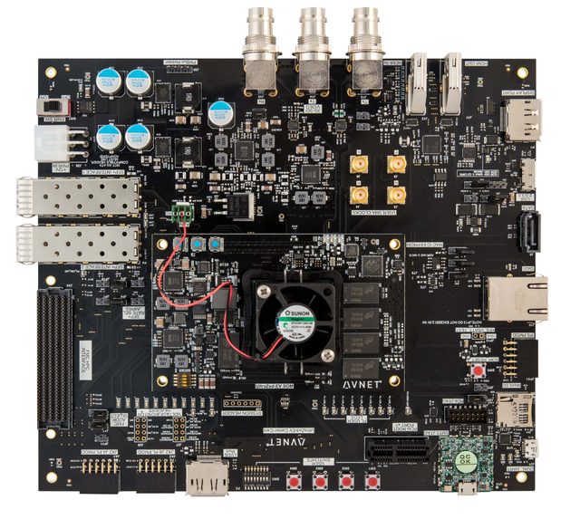
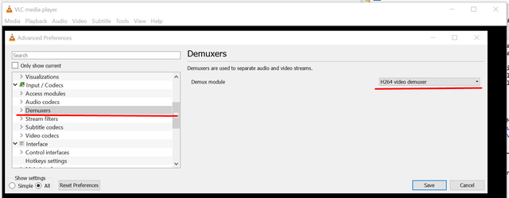
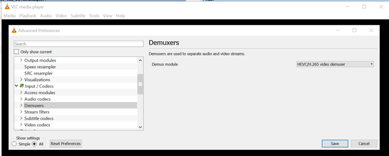
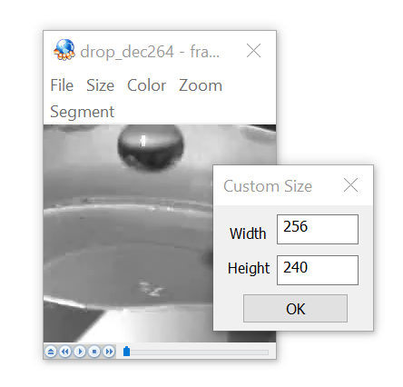
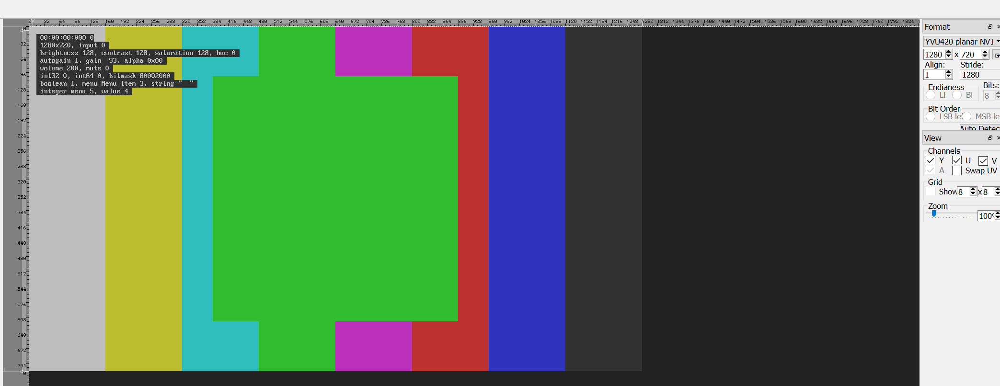

# UltraZed-EV VCU Lib Test (Windows Xilinx SDK  2018.3) 

Ready to use Xilinx Video Codec Unit library with Xilinx SDK. Main goal is build and debug vcu module with IDE.

## Getting Started

This repository contains example how to build library and app for an easy start debugging with it. 

 - -[vcu-ctrl-sw](https://github.com/Xilinx/vcu-ctrl-sw) - Official Xilinx repositories vcu-ctrl-sw
 - -[vcu-omx-il](https://github.com/Xilinx/vcu-omx-il) - Official Xilinx repositories vcu-omx-il


### Prerequisites

- Windows 10
- Xilinx SDK 2018.3 
- [UltraZed-EV Starter Kit](http://zedboard.org/product/ultrazed-ev-starter-kit)  



### Set up workspace

- clone  
- open as workspace with Xilinx SDK 2018.3
- import projects 
- set off Build Automatically

```
Menu: Project -> Build Automatically off
```

### Import projects

```
right click on Project Explorer -> Import -> General -> Existings Project Into Workspace -> Browse -> Finish
```


### Build

 Workspace consists of:

- **vcu-ctrl-sw-xilinx-v2018-3** - main library for control vcu (build first)
- **vcu-ctrl-lib-app** - library for application  (build second)
- **vcu-ctrl-encoder** - encoder application
- **vcu-ctrl-decoder** - decoder application

- **vcu-omx-il-xilinx-v2018-3** - omx library for control vcu (build first)
- **vcu-omx-encoder** - omx encoder application
- **vcu-omx-decoder** - omx decoder application

- **v4l2_capture_raw** - video capture application

### Prepare board

Images were taken by the  R. Jason Moss [blog post](https://www.element14.com/community/community/designcenter/zedboardcommunity/ultrazed/ultrazed-ev/blog/2019/07/09/ultrazed-ev-io-carrier-card-vcu-design-example-v20183)

- download bins from dropbox [files](https://www.dropbox.com/sh/5t0dag4momczk0j/AADh7vHkb0LU07Et-9y4ecYha?dl=0)
- copy files from *dropbox/images/*  to *SD/* card
- load linux *root:root*
- connect to ethernet
- set correct IP Address ( ```$ ifconfig eth0 up && ifconfig eth0 192.168.33.2 netmask 255.255.0.0 ```)
- prepare and connect WinSCP.exe by SFTP for copying files to target


### Testing

**Test vcu-ctrl-encoder**

- copy *vcu-ctrl-encoder/Debug/vcu-ctrl-encoder_debug.elf*  to */home*
- copy */images/drop.yuv* to */home*
- copy */images/vcu_encode_h264.cfg* to */home*
- copy */images/vcu_encode_h265.cfg* to */home*

```$ cd /home ``` 

```$ chmod +x ./vcu-ctrl-encoder_debug.elf ``` 

```$  ./vcu-ctrl-encoder_debug.elf -cfg vcu_encode_h264.cfg ``` 

```$  ./vcu-ctrl-encoder_debug.elf -cfg vcu_encode_h265.cfg ``` 

In folder /home will appear two files **drop_vcuenc.h264** and **drop_vcuenc.h265** files.
Copy both to Host and play with VLC media Player.

  

**Test vcu-ctrl-decoder**

- copy *vcu-ctrl-decoder/Debug/vcu-ctrl-decoder_debug.elf*  to */home*

```$ cd /home ``` 

```$ chmod +x ./vcu-ctrl-decoder_debug.elf ``` 

```$ ./vcu-ctrl-decoder_debug.elf -avc -in drop_vcuenc.h264 -out drop_dec264.yuv ``` 

```$ ./vcu-ctrl-decoder_debug.elf -hevc -in drop_vcuenc.h265 -out drop_dec265.yuv ``` 

In folder /home will appear two files **drop_dec264.yuv** and **drop_dec265.yuv** files.
Copy both to Host and play with YUV Player.

 

----------


**Test vcu-omx-encoder**

- copy */vcu-omx-encoder/Debug/vcu-omx-encoder_debug.elf*  to */home*
- copy */images/drop.yuv* to */home*

```$ cd /home ``` 

```$ chmod +x ./vcu-omx-encoder_debug.elf ``` 

```$ ./vcu-omx-encoder_debug.elf  drop.yuv --width 256 --height 240 --framerate 25 --avc --out drop_omxenc.h264 ```

```$ ./vcu-omx-encoder_debug.elf  drop.yuv --width 256 --height 240 --framerate 25 --hevc --out drop_omxenc.h265 ```

In folder /home will appear two files **drop_omxenc.h264** and **drop_omxenc.h265** files.
Copy both to Host and play with VLC media Player.

**Test vcu-omx-decoder**

- copy */vcu-omx-decoder/Debug/vcu-omx-decoder_debug.elf*  to */home*

```$ cd /home ``` 

```$ chmod +x ./vcu-omx-decoder_debug.elf ``` 

```$ ./vcu-omx-decoder_debug.elf drop_omxenc.h264 -avc -o drop_omx264.yuv ``` 

```$ ./vcu-omx-decoder_debug.elf drop_omxenc.h265 -hevc -o drop_omx265.yuv ``` 

In folder /home will appear two files **drop_omx264.yuv** and **drop_omx265.yuv** files.
Copy both to Host and play with YUV Player.

----------

**Test v4l2_capture_raw**

Current hardware bitstream for UltraZed-EV does not include any capture port by that reason I have prepared virtual video source module **vivid.ko**. 

- copy *dropbox/module/vivid.ko*  to */home* card
- copy *v4l2_capture_raw/Debug/v4l2_capture_raw.elf*  to */home*


```$ cd /home ``` 
```$ chmod +x ./v4l2_capture_raw.elf.elf ``` 

```$ insmod vivid.ko ``` 

```$ v4l2-ctl --list-devices  ``` 

```vivid (platform:vivid-000):
	/dev/video
	/dev/video1
	/dev/radio0
	/dev/radio1
	/dev/vbi0
	/dev/vbi1
	/dev/swradio0```

```$ ./v4l2_capture_raw.elf -o  -m -f -c 10 ``` 

Files will appear in the folder */home*. Copy to host and open with YUV viewer.  
Settings of files: YUV420 planar NV12 1280*720 

 


